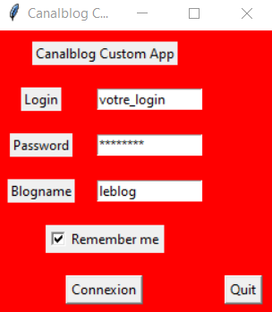

# Readme
- [Readme](#readme)
  - [First](#first)
    - [Goal](#goal)
    - [Security](#security)
    - [Remarks](#remarks)
  - [How to use it](#how-to-use-it)
      - [Prerequisites](#prerequisites)
      - [Launch](#launch)
    - [Build for Windows](#build-for-windows)
      - [Prerequisites](#prerequisites-1)
      - [Configuration](#configuration)
      - [Build](#build)
        - [For msi package installer](#for-msi-package-installer)
          - [For exe application only](#for-exe-application-only)
  - [Tutorial](#tutorial)
    - [Execute **.msi** or **.exe**](#execute-msi-or-exe)
    - [You have a new icon on your Desktop :)](#you-have-a-new-icon-on-your-desktop-)
    - [Connection](#connection)
    - [Download or Upload](#download-or-upload)
    - [Upload](#upload)
      - [Choose one album](#choose-one-album)
      - [Choose dir containing picture to upload](#choose-dir-containing-picture-to-upload)
      - [Upload button](#upload-button)
      - [Disclaimer](#disclaimer)
    - [Download](#download)
      - [Choose one album](#choose-one-album-1)
      - [Choose dir to download picture](#choose-dir-to-download-picture)
      - [Download button](#download-button)
      - [Disclaimer](#disclaimer-1)
    - [Application closure](#application-closure)
    - [Uninstallation](#uninstallation)

## First
### Goal
The goal of this application is to download and upload picture to Canalblog plateform.

### Security
All your personal information entered in this application is stored on your computer.
More precisely in your user directory, directory: .cca
They are only used by this application in order to establish a connection to Canalblog with your associated rights.

### Remarks
The graphic part is not my strong point.
Sorry about that!

## How to use it
### With Python on your system
#### Prerequisites
    python -m pip install -r requirements.txt
#### Launch
    python main.py

### Build for Windows
#### Prerequisites
    python -m pip install -r requirements.txt
    python -m pip install -r requirements_win32.txt
#### Configuration
Edit the setup.py file to adjust your Python Path for dll.
#### Build
##### For msi package installer
    python setup.py bdist_msi

###### For exe application only
    python setup.py build

## Tutorial
### Execute **.msi** or **.exe**

### You have a new icon on your Desktop :)

### Connection

Add 3 informations
- login
- password
- blog name

You can remember your credentials by clic on ***"Remember me"*** button.
It'll save a config.yaml file on your homedir.
- ~/.cca/config.yaml (Linux)
- $HOMEDIR\.cca\config.yaml (Windows)

### Download or Upload

You can choose **Download** or **Upload** button!

### Upload

#### Choose one album
Choose your an existing album.
You can create it on the Canablog website before.

#### Choose dir containing picture to upload
Choose sur directory contain the picture to send on the album.
It take all picture on the directory (jpg/gif/png) but not recursivly.

Do not reduce the image size, Canablog do it automaticly.

#### Upload button
A popup ask you to confirm the action.
Wait until the **Success** message.

#### Disclaimer
Be carreful, if you quit the application before the success message, it'll stop the transfert.
If you redo the action, it'll re-upload all picture on the directory.
Actually, the application don't check if an image already exist on album.

### Download

#### Choose one album
Select the album.

#### Choose dir to download picture
Choose the directoty where the picture will be save.
It'll automaticly create a directory with the album name.

#### Download button
A popup ask you to confirm the action.
Wait until the **Success** message.

#### Disclaimer
Be carreful, if you quit the application before the success message, it'll stop the transfert.
If you redo the action, it'll re-download all picture on the directory.
Actually, the application don't check if an image already exist on album.
But you'll don't have duplicate picture.

### Application closure
Just clic on **"Quit"**button on bottom right.

### Uninstallation
