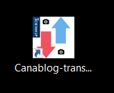

# Readme
- [Readme](#readme)
  - [Premièrement](#premièrement)
    - [Objectif](#objectif)
    - [Securité](#securité)
    - [Remarques](#remarques)
  - [Comment l'utiliser](#comment-lutiliser)
    - [Directement avec Python](#directement-avec-python)
      - [Prérequis](#prérequis)
      - [Lancement](#lancement)
    - [Générer un exécutable Windows](#générer-un-exécutable-windows)
      - [Prérequis](#prérequis-1)
      - [Configuration](#configuration)
      - [Génération](#génération)
        - [Paquet d'installation MSI](#paquet-dinstallation-msi)
          - [Application EXE](#application-exe)
  - [Tutoriel](#tutoriel)
    - [Exécuter **.msi** or **.exe**](#exécuter-msi-or-exe)
    - [Vous avez une nouvelle icône sur votre bureau](#vous-avez-une-nouvelle-icône-sur-votre-bureau)
    - [Connexion](#connexion)
    - [Download or Upload](#download-or-upload)
    - [Envoi](#envoi)
      - [Choix de l'album](#choix-de-lalbum)
      - [Choix du répertoire contenant les images](#choix-du-répertoire-contenant-les-images)
      - [Bouton Upload](#bouton-upload)
      - [Avertissement](#avertissement)
    - [Téléchargement](#téléchargement)
      - [Choix de l'album](#choix-de-lalbum-1)
      - [Choix du répertoire de réception](#choix-du-répertoire-de-réception)
      - [Bouton Download](#bouton-download)
      - [Avertissement](#avertissement-1)
    - [Fermeture de l'application](#fermeture-de-lapplication)
    - [Désinstallation](#désinstallation)

## Premièrement
### Objectif
Le but de l'application est de téléchatger ou envoyer des images sur la plateforme Canalblog.

### Securité
Toutes vos informations personnelles saisies dans cette application sont stockées sur votre ordinateur.
Plus précisément dans votre répertoire d'utilisateurs, répertoire : .cca
Ils ne sont utilisés par cette application que pour établir une connexion à Canalblog avec vos droits associés.

### Remarques
La partie graphique n'est pas mon point fort...
Désolé pour ça!

## Comment l'utiliser
### Directement avec Python
#### Prérequis
    python -m pip install -r requirements.txt
#### Lancement
    python main.py

### Générer un exécutable Windows
#### Prérequis
    python -m pip install -r requirements.txt
    python -m pip install -r requirements_win32.txt
#### Configuration
Editer le fichier **setup.py** et ajuster les répertoires de votre installation Python.
#### Génération
##### Paquet d'installation MSI
    python setup.py bdist_msi

###### Application EXE
    python setup.py build

## Tutoriel
### Exécuter **.msi** or **.exe**

### Vous avez une nouvelle icône sur votre bureau

### Connexion

Ajouter 3 informations
- utilisateur
- mot de passe
- nom du blog

La case à cocher « Remember me », permet d’enregistrer ces
informations dans un fichier de configuration sur votre ordinateur
qui sera lu au prochain lancement de l’application.
Le bouton connexion, ouvrira une popup vous affichant si la
connexion est un succès ou pas.

### Download or Upload

Vous pouvez choisir **Download** pour télécharger ou **Upload** pour envoyer.

### Envoi

#### Choix de l'album
Une liste déroulante affiche tous les albums de votre blog. Sélectionnez en un.
Il faut donc que l’album existant avant, pour pouvoir envoyer des photos dedans.

#### Choix du répertoire contenant les images
Vous choisissez ici le répertoire contenant les photos à envoyer.
L’application prendre toutes les photos sur répertoire (pas de ses sous répertoire).
Les extensions de fichiers doivent être jpg/gif/png.
L’application ne prendra pas les autres fichiers.
Il n’y a pas besoin de redimensionner les photos, cette partie est gérée côté Canalblog.

#### Bouton Upload
Cela va vous demander une confirmation puis une popup s’ouvrira avec l’état d’avancement.
Laissez tourner jusqu’au message de succès.

#### Avertissement
Attention, si vous arrêtez l’application avant la fin de l’envoi, et que vous recommencez l’envoi, l’application n’est
pas conçue pour vérifier si

### Téléchargement

#### Choix de l'album
Une liste déroulante affiche tous les albums du blog. Sélectionnez en un.

#### Choix du répertoire de réception
Vous choisissez ici le répertoire où les photos seront téléchargées.
Cela créera un répertoire au nom de l’album automatiquement.

#### Bouton Download
Cela va vous demander une confirmation puis une popup s’ouvrira avec l’état d’avancement.
Laissez tourner jusqu’au message de succès.

#### Avertissement
Attention, si vous arrêtez l’application avant la fin du téléchargement et que vous recommencez le téléchargement,
l’application n’est pas conçue pour vérifier si des photos existent déjà dans le répertoire de votre ordinateur, cela re-
téléchargera tout. Mais il n’y aura pas de doublons.

### Fermeture de l'application
Cliquez simplement sur le bouton « Quit » en bas à droite.

### Désinstallation

Recherchez : Ajouter ou supprimer des programmes
Vous trouverez l’application et pourrez la désinstaller.